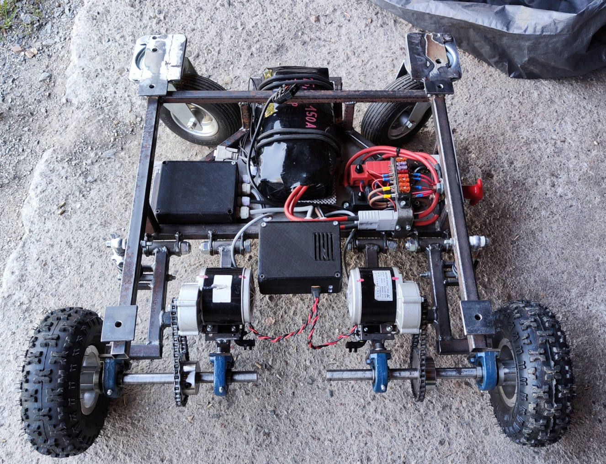

# Overview
Firmware for a homemade automated electric armchair.  
Extensive details about this project can be found on the website:
- ~~V1: [Electric Armchair V1](https://pfusch.zone/electric-armchair)~~
- V2: [Electric Armchair V2](https://pfusch.zone/electric-armchair-v2)

Note: In the current version V2.2, only the esp-project in the [board_single/](board_single) folder and the custom libraries in [common/](common) are used.  
The projects in the folders `board_control/` and `board_motorctl/` are no longer compatible and legacy from V2.1.



*Photo of the built frame that carries the armchair*

## Hardware Setup / Electrical
### PCB
The firmware in this repository is designed for an ESP32 microcontroller integrated into a custom PCB developed here: [Project Work 2020](https://pfusch.zone/project-work-2020)

### Connection Plan
A detailed diagram illustrating all components and wiring can be found in the file [connection-plan.drawio.pdf](connection-plan.drawio.pdf)

For more details refer to the documentation on the website.


## Current Features
- Control Modes:
  - Joystick: Control via hardware joystick mounted on the right armrest
  - HTTP: Control via virtual joystick on a web interface
  - Massage: Armchair shaking depending on stick position
  - Auto: Execute stored driving commands sequentially
- Electric Chair Adjustment: Leg and backrest control via joystick
- Advanced Motor Control: Configurable motor fading (acceleration, deceleration limit), current limit, braking; compatible with different hardware
- Wi-Fi:
  - Hosts wireless network
  - Webserver with webroot in SPIFFS
  - HTTP API for controlling the chair
- UART Communication between 2 boards (V2.1)
- Speed Measurement: Measures speed and direction of each tire individually using custom encoders
- Current Measurement: Monitors current of each motor
- Battery Capacity: Measures battery voltage and calculates percentage according to discharge curve
- Fan Control: Cooling fan for motor driver activated only when needed
- Display + Rotary encoder:
  - Various status screens showing battery status, speed, RPM, motor current, mode, power, duty cycle, stick data
  - Menu for setting various options using encoder (options are stored persistently in nvs flash)
  - Menu for selecting the control mode
- Buzzer: Provides acoustic feedback when switching modes or interacting with menu

## Planned Features
- More Sensors:
  - Accelerometer
  - Lidar sensor / collision detection
  - GPS receiver
  - Temperature sensors
- Anti-Slip Regulation
- Self-Driving Algorithm
- Lights
- Improved Web Interface
- App
- Camera


# Installation
### Install esp-idf
For this project **ESP-IDF v4.4.4** is required (with other versions it might not compile)
```bash
#download esp-idf
yay -S esp-idf #alternatively clone the esp-idf repository from github
#run installation script in installed folder
/opt/esp-idf/install.sh
```
### Clone this repo
```
git clone git@github.com:Jonny999999/armchair_fw
```
### Instal node packages
For the react app packages have to be installed using npm. TODO: add this to cmake?
```
cd react-app
npm install
```


# Building the Project
## React-webapp
When flashing to the ESP32, the files in the `react-app/build/` folder are written to a SPIFFS partition.  
These files are then served via HTTP in the Wi-Fi network "armchair" created by the ESP32.  
In HTTP control mode, you can control the armchair using a joystick on the provided website.  

Initially, or when changing the React code, you need to manually build the React app:
```bash
cd react-app
#compile
npm run build
#remove unwanted license file (filename too long for spiffs)
rm build/static/js/main.8f9aec76.js.LICENSE.txt
```
Note: Use `npm start` for starting the webapp locally for testing


## Firmware
### Set up environment
```bash
source /opt/esp-idf/export.sh
```
(run once per terminal)

### Compile
```bash
cd board_single
idf.py build
```

### Upload
- connect FTDI programmer to board (VCC to VCC; TX to RX; RX to TX)
- press REST and BOOT button
- release RESET button (keep pressing boot)
- run flash command:
```bash
idf.py flash
```
- once "connecting...' was successfully, BOOT button can be released


### Monitor
To view log output for debugging, follow the same steps as in the Upload section, but run:
```bash
idf.py monitor
```


# Usage / User Interface

## Encoder Functions

**When not in MENU mode**, the button (encoder click) has the following functions:

| Count | Type          | Action               | Description                                                                                 |
|-------|---------------|----------------------|---------------------------------------------------------------------------------------------|
| 1x long | switch mode | **MENU_MODE_SELECT** | Open menu for selecting the current control mode                                            |
| 1x      | control     | [MASSAGE] **freeze** input  | When in massage mode: lock or unlock joystick input at current position.             |
| 1x short, 1x long | switch mode | **ADJUST-CHAIR**  | Switch to mode where the armchair leg and backrest are controlled via joystick.      |
| 2x      | toggle mode | **IDLE** <=> previous| Enable/disable chair armchair (e.g., enable after startup or switch to previous mode after timeout). |
| 3x      | switch mode | **JOYSTICK**         | Switch to JOYSTICK mode, to control armchair using joystick (default).                      |
| 4x      | switch mode | **HTTP**             | Switch to **remote control** via web-app `http://191.168.4.1` in wifi `armchair`.           |
| 5x      | switch mode | **MENU_SETTINGS**    | Open menu to set various options, controlled via display and rotary encoder.                |
| 6x      | switch mode | **MASSAGE**          | Switch to MASSAGE mode where armchair shakes differently, depending on joystick position.   |
| 7x      |             |                      |                                                                                             |
| 8x      | toggle option| **deceleration limit** | Disable/enable deceleration limit (default on) => more responsive.                       |
| 12x     | toggle option| **alt stick mapping** | Toggle between default and alternative stick mapping (reverse direction swapped).         |

**When in MENU_SETTINGS mode** (5x click), the encoder controls the settings menu: (similar in MENU_MODE_SELECT)

| Encoder Event | Current Menu | Action                                                       |
|---------------|--------------|--------------------------------------------------------------|
| long press    | main-menu    | Exit MENU mode to previous control mode (e.g., JOYSTICK).    |
| long press    | value-select | Exit to main-menu without changing the value.                |
| click         | main-menu    | Select currently highlighted menu item -> enter value-select screen. |
| click         | value-select | Confirm value / run action.                                  |
| rotate        | main-menu    | Scroll through menu items.                                   |
| rotate        | value-select | Change value.                                                |

## HTTP Mode
Control the armchair via a virtual joystick on the web interface.

**Usage:**
- Switch to HTTP mode (4 button presses).
- Connect to WiFi `armchar`, no password.
- Access http://192.168.4.1 (note: **http** NOT https, some browsers automatically add https!).