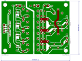
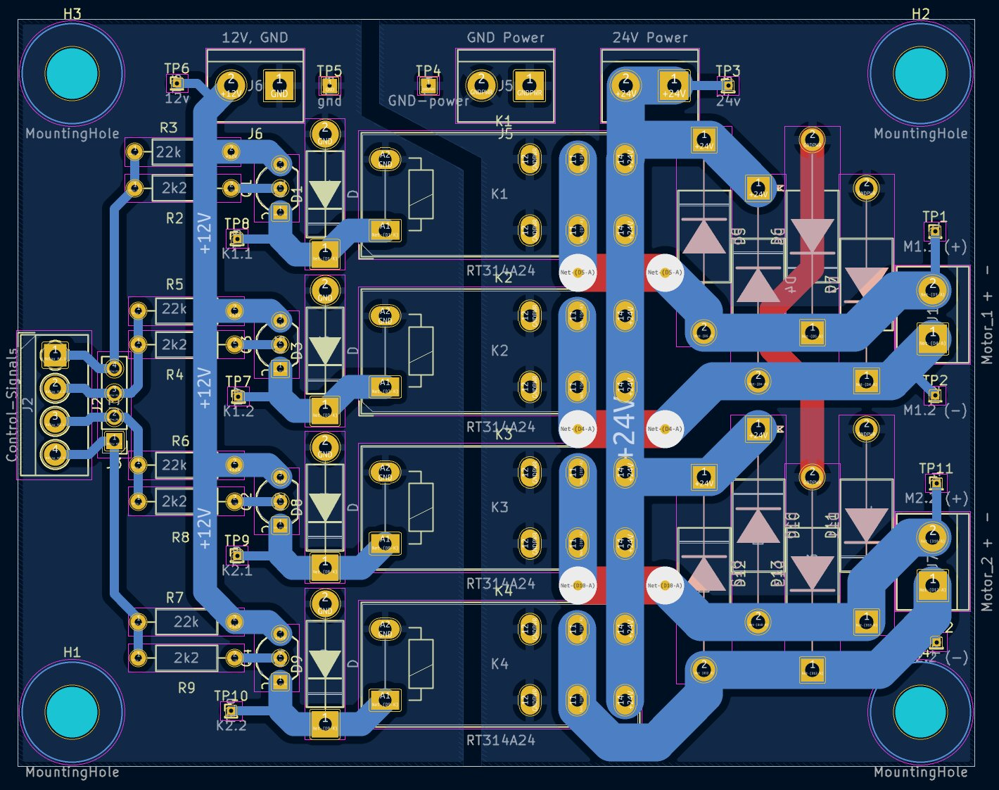

# Overview
This repository contains the firmware for a custom-built automated electric armchair.  
Detailed project information and documentation is available on the website:
- ~~V1: [Electric Armchair V1](https://pfusch.zone/electric-armchair)~~
- V2: [Electric Armchair V2](https://pfusch.zone/electric-armchair-v2)

**Note:** In the current version _V2.2_, only the esp-project in the [board_single/](board_single) folder and the custom libraries in [common/](common) are used.  
The projects in the folders `board_control/` and `board_motorctl/` are no longer compatible and are legacy from _V2.1_.

<br>
*Photo of the built frame that carries the armchair*

<br>

## Current Features
- **Control Modes:**
  - **Joystick:** Control movement via hardware joystick mounted on the right armrest
  - **HTTP:** Control movement via virtual joystick on a web interface
  - **Massage:** Armchair shaking depending on stick position
  - **Adjust:** Control leg and backrest position via joystick
  - **Auto:** Execute stored driving commands sequentially
- **Advanced Motor Control:**
  - Deceleration limit
  - Acceleration limit
  - Current limit
  - Braking
  - Compatible with different motor drivers:
    - 3 pins: A, B, PWM - e.g. various common H-Bridges
    - 1 pin: UART/RS232 - e.g. Sabertooth
- **Input/Sensors:**
  - **Speed Measurement:** Measures speed and direction of each tire individually using custom built encoders
  - **Current Measurement:** Monitors current of each motor
  - **Battery Voltage:** Measures battery voltage and calculates percentage according to discharge curve
  - **Analog Joystick:** 
    - Evaluate two analog signals to get coordinates, radius and angle
    - Calibration wizard/sequence
    - Calibration stored persistently in nvs
- **Fan Control:** Cooling fan for motor driver are activated when needed only
- **Buzzer:** Provides acoustic feedback when switching modes or interacting with menu
- **OLED-Display + Rotary-encoder:**
  - Various status screens showing battery status, speed, RPM, motor current, mode, power, duty cycle, stick data
  - Menu for setting various options using encoder
  - Changed settings are stored persistently in NVS flash
  - Menu for selecting the control mode
- **UART Communication between 2 Boards (V2.1)**
- **Electric Chair Adjustment:** Control 4 Relays powering motors that adjust the chair rest positions
- **Wi-Fi:**
  - Hosts wireless network
  - Web server with webroot in SPIFFS
  - HTTP API for controlling the chair (remote control)
- **React web-app:** Virtual joystick sending data to http-API (placed in SPIFFS)


## Planned Features
#### Hardware
- More Sensors:
  - Accelerometer
  - Lidar sensor / collision detection
  - GPS receiver
  - Temperature sensors
- Lights
- Camera
#### Algorithms
- Anti-Slip Regulation
- Self-Driving Algorithm
#### UI
- Improved Web Interface
  - Settings
  - Chair adjustment
- Simple App

<br>

## Hardware Setup / Electrical
### Control-PCB
The firmware is designed for an ESP32 microcontroller integrated into a custom PCB developed here: [Project Work 2020](https://pfusch.zone/project-work-2020)

### Connection Plan
A detailed diagram illustrating all components and wiring can be found in the file [connection-plan.drawio.pdf](connection-plan.drawio.pdf).   
For more details refer to the documentation on the [website](https://pfusch.zone/electric-armchair-v2).

### Chair-Adjust Relay-Board
A custom pcb with relays and protection for controlling the 2 motors that adjust the rest positions of the armchair was created in this repository as well:
Date: 2024.09.08  
Folder: [hardware/chairAdjust-relayBoard](hardware/chairAdjust-relayBoard)  
Schematic: [hardware/chairAdjust-relayBoard/export/schematic.pdf](hardware/chairAdjust-relayBoard/export/schematic.pdf)
<br>
<br>
<p align="center">


</p>


<br>
<br>


# Installation
### Install ESP-IDF
For this project **ESP-IDF v4.4.4** is required
```bash
#download esp-idf
yay -S esp-idf #alternatively clone the esp-idf repository from github
#run installation script in installed folder
/opt/esp-idf/install.sh
```
### Clone Repository
```
git clone git@github.com:Jonny999999/armchair_fw
```
### Install Node Packages
Navigate to the react-app directory and install required packages using npm:
```
cd react-app
npm install
```


<br>
<br>


# Building the Project
## React-webapp
When flashing to the ESP32, the files in the `react-app/build/` folder are written to a SPIFFS partition.  
These files are then served via HTTP in the Wi-Fi network "armchair" created by the ESP32.  

Initially, or when changing the React code, you need to manually build the React app:
```bash
cd react-app
#compile
npm run build
#remove unwanted license file (filename too long for spiffs)
rm build/static/js/main.8f9aec76.js.LICENSE.txt
```
**Note:** For testing the app locally, use `npm start`


## Firmware
### Environment Setup
```bash
source /opt/esp-idf/export.sh
```
Run once per terminal

### Compilation
```bash
cd board_single
idf.py build
```

### Upload
- Connect FTDI programmer to board (GND to GND, TX to RX, RX to TX)
- Press RESET and BOOT button
- Release RESET button (keep pressing boot)
- Release boot button
- Run flash command:
```bash
idf.py flash
```


### Monitor
To view log output for debugging, follow the same steps as in the Upload section, but run:
```bash
idf.py monitor
```


<br>
<br>


# Usage / User Interface

## Quickstart
- **Browse / select any mode**
  - `[long press]` opens menu for selecting the desired mode (*JOYSTICK* for driving)
- **Driving**
  - `[3x click]` enters *JOYSTICK* mode
- **Rest position**
  - `[rotate]` adjusts the leg rest position  
  - `[press + rotate]` at the same time: adjusts the back rest position
  - alternatively enter *ADJUST* mode and control rests via joystick

<br>

## Encoder Functions
- *When not in MENU mode*, **rotating the encoder** has the following functions:

|     Encoder Event   |          Action           |
|---------------------|---------------------------|
| rotate left         | Move leg rest up by 10%   |
| rotate right        | Move leg rest DOWN by 10% |
| press + rotate left | Move back rest down by 5% |
| press + rotate left | Move back rest up by 5%   |

Note: first tick is ignored -> quickly rotate 2 ticks at first

<br>

- *When not in MENU mode*, **clicking the encoder** has the following functions:

| Count | Type          | Action               | Description                                                                                 |
|-------|---------------|----------------------|---------------------------------------------------------------------------------------------|
| 1x long | switch mode | **MENU_MODE_SELECT** | Open **menu for selecting the current control mode**                                            |
| 1x      | control     | [MASSAGE] **freeze** input  | When in massage mode: lock or unlock joystick input at current position.             |
| 1x short, 1x long | switch mode | **ADJUST-CHAIR**  | Switch to mode where the armchair leg and backrest are controlled via joystick.      |
| 2x      | toggle mode | **IDLE** <=> previous| Enable/disable chair armchair (e.g., enable after startup or switch to previous mode after timeout). |
| 3x      | switch mode | **JOYSTICK**         | Switch to JOYSTICK mode, to control armchair using joystick (default).                      |
| 4x      | switch mode | **HTTP**             | Switch to **remote control** via web-app `http://191.168.4.1` in wifi `armchair`.           |
| 5x      | switch mode | **MENU_SETTINGS**    | Open menu to set various options, controlled via display and rotary encoder.                |
| 6x      | switch mode | **MASSAGE**          | Switch to MASSAGE mode where armchair shakes differently, depending on joystick position.   |
| 7x      |             |                      |                                                                                             |
| 8x      | toggle option| **deceleration limit** | Disable/enable deceleration limit (default on) => more responsive.                       |
| 12x     | toggle option| **alt stick mapping** | Toggle between default and alternative stick mapping (reverse direction swapped).         |


<br>

- When in **MENU_SETTINGS mode** (5x click), the encoder controls the settings menu: (similar in MENU_MODE_SELECT)

| Encoder Event | Current Menu | Action                                                       |
|---------------|--------------|--------------------------------------------------------------|
| long press    | main-menu    | Exit MENU mode to previous control mode (e.g., JOYSTICK).    |
| long press    | value-select | Exit to main-menu without changing the value.                |
| click         | main-menu    | Select currently highlighted menu item -> enter value-select screen. |
| click         | value-select | Confirm value / run action.                                  |
| rotate        | main-menu    | Scroll through menu items.                                   |
| rotate        | value-select | Change value.                                                |

<br>

## HTTP Mode
Control the armchair via a virtual joystick on the web interface.

**Usage:**
- Switch to HTTP mode (4 button presses or via mode-select menu).
- Connect to WiFi `armchair`, no password.
- Access http://192.168.4.1 (note: **http** NOT https, some browsers automatically add https!).